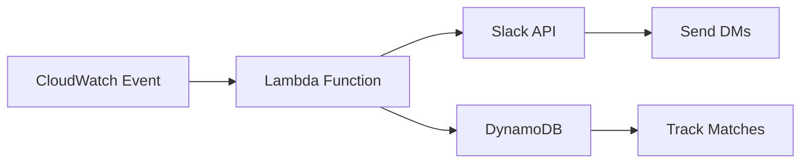

<div align="center">

# 👋 New Starters MeetUp

> **Automated Slack introductions for new team members - Schedule virtual coffee chats and team meetups**


[Features](#-features) • [Quick Start](#-quick-start) • [Configuration](#️-configuration) • [Contributing](#-contributing)

</div>

---


## ✨ Features

| Feature | Description |
|---------|-------------|
| 🤖 **Automated Introductions** | Auto-detect new hires and send welcome messages |
| ☕ **Coffee Chat Scheduling** | Schedule random 1:1 introductions with team members |
| 📅 **Calendar Integration** | Check availability before scheduling |
| 🎯 **Smart Matching** | Match new starters with relevant team members |
| 📊 **Analytics** | Track engagement and participation |
| ⚡ **Serverless** | AWS Lambda for cost-effective scaling |
| 🔔 **Reminders** | Send follow-up reminders for scheduled meetups |

---

## 📋 Prerequisites

| Requirement | Version |
|-------------|---------|
| Python | 3.11+ |
| AWS Account | With Lambda access |
| Slack App | With Bot Token |
| Slack Workspace | Admin access for app installation |

---

## 🚀 Quick Start

### 1. Clone the Repository

```bash
git clone https://github.com/CaputoDavide93/new-starters-meetup.git
cd new-starters-meetup
```

### 2. Configure Environment

```bash
cp .env.example .env
# Edit .env with your settings
```

### 3. Install Dependencies

```bash
pip install -r requirements.txt
```

### 4. Deploy to AWS

```bash
cd deploy
./deploy.sh
```

---

## ☁️ AWS Deployment

### Lambda Function Setup

```bash
# Package the Lambda function
cd Layer
zip -r lambda_layer.zip python/

# Deploy using AWS CLI
aws lambda publish-layer-version \
  --layer-name newstarters-deps \
  --zip-file fileb://lambda_layer.zip
```

### CloudWatch Event Rule

Schedule the function to run periodically:

```json
{
  "schedule": "cron(0 9 ? * MON-FRI *)"
}
```

---

## ⚙️ Configuration

### Environment Variables

| Variable | Description | Required |
|----------|-------------|----------|
| `SLACK_BOT_TOKEN` | Slack Bot OAuth token | ✅ |
| `SLACK_SIGNING_SECRET` | Slack app signing secret | ✅ |
| `SLACK_CHANNEL_ID` | Channel for introductions | ✅ |
| `NEW_HIRE_CHANNEL` | New hire tracking channel | ✅ |
| `MATCHING_ALGORITHM` | Matching strategy | ❌ |
| `INTRO_DELAY_DAYS` | Days before first intro | ❌ |

### Slack App Permissions

Required Bot Token Scopes:

```
channels:read
chat:write
users:read
users:read.email
im:write
```

### Configuration File

```yaml
# config.yaml
slack:
  bot_token: "${SLACK_BOT_TOKEN}"
  channel: "#new-starters"
  
matching:
  algorithm: "random"  # or "department", "role"
  max_matches: 3
  delay_days: 2

messages:
  welcome: "👋 Welcome to the team, {name}!"
  intro_request: "☕ Time for a virtual coffee chat?"
```

---

## 📖 Usage

### Manual Trigger

```bash
python src/main.py --trigger-now
```

### Test Mode

```bash
python src/main.py --dry-run
```

### View Pending Introductions

```bash
python src/main.py --list-pending
```

---

## 🔧 Architecture


```mermaid
graph LR
    A[CloudWatch Event] --> B[Lambda Function]
    B --> C[Slack API]
    C --> D[Send DMs]
    B --> E[DynamoDB]
    E --> F[Track Matches]
```

### Project Structure

```
new-starters-meetup/
├── src/
│   ├── common/              # Shared utilities (Lambda Layer)
│   │   ├── config.py        # Secrets Manager loader
│   │   ├── azure_sync.py    # Azure AD group sync
│   │   ├── calendar_utils.py # Google Calendar ops
│   │   └── dynamo_utils.py  # DynamoDB weight mgmt
│   ├── ui_lambda/
│   │   └── ui_entry.py      # Slack UI handler
│   └── worker_lambda/
│       └── worker_entry.py  # Background worker
├── Layer/
│   └── python/              # Lambda dependencies
├── deploy/
│   └── deploy.sh            # Deployment script
├── scripts/
│   └── build.sh             # Build script
└── .env.example             # Environment template
```

### CloudWatch Logs

```bash
# UI Lambda logs
aws logs tail /aws/lambda/IntroUI-Lambda --follow

# Worker Lambda logs
aws logs tail /aws/lambda/IntroWorker-Lambda --follow
```

---

## 🐛 Troubleshooting

| Issue | Solution |
|-------|----------|
| Slack API `not_authed` | Verify your bot token with `curl -X POST https://slack.com/api/auth.test -H "Authorization: Bearer $SLACK_BOT_TOKEN"` |
| "No partner available" | Check Azure AD group sync and DynamoDB table |
| "Calendar slot not found" | Verify Google Calendar permissions |
| FreeBusy `notFound` errors | The user's Google Calendar is not accessible. Ensure the service account has domain-wide delegation and the user has a Google Workspace account. Users with only Microsoft 365 accounts will have their calendar errors logged as warnings |
| "Timeout" | Increase Lambda memory/timeout, reduce meeting count |
| "Signature mismatch" | Verify Slack signing secret |
| "Permission denied" | Check IAM roles and policies |

---

## 🤝 Contributing

Contributions are welcome! Please see [CONTRIBUTING.md](CONTRIBUTING.md) for guidelines.

1. Fork the repository
2. Create a feature branch (`git checkout -b feature/amazing-feature`)
3. Commit changes (`git commit -m 'Add amazing feature'`)
4. Push to branch (`git push origin feature/amazing-feature`)
5. Open a Pull Request

---

## 🔒 Security

Please see [SECURITY.md](SECURITY.md) for reporting vulnerabilities.

---

## 📄 License

This project is licensed under the MIT License - see the [LICENSE](LICENSE) file for details.

---

<div align="center">

## 👤 Author

**Davide Caputo**

[](https://github.com/CaputoDavide93)
[](mailto:CaputoDav@gmail.com)

---

⭐ **If this tool helped you, please give it a star!** ⭐

</div>
