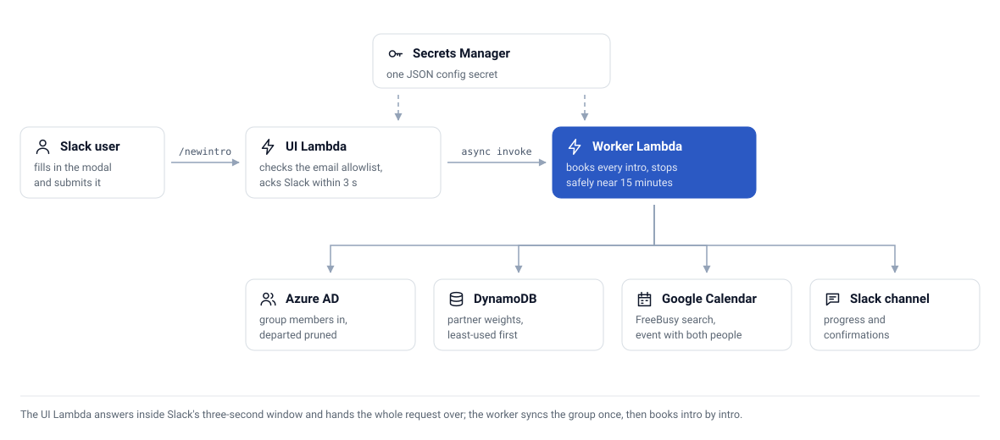

<div align="center">

# 🤝 New Starters MeetUp

**A Slack `/newintro` command that books coffee-chat and buddy intro meetings for new starters — serverless, on two AWS Lambdas.**


[](https://github.com/CaputoDavide93/New-Starters-Meetup/actions/workflows/ci.yml)

[Features](#-features) • [Architecture](#️-architecture) • [Quick Start](#-quick-start) • [Configuration](#️-configuration) • [Usage](#-usage) • [Contributing](#-contributing)

</div>

---

## ✨ Features

| | Feature | What it does |
|---|---|---|
| ⚡ | `/newintro` slash command | Opens a Slack modal to book Coffee ☕️ or Buddy 🤝 intros for a list of emails |
| 🪪 | Azure AD group sync | Pulls the pool of intro partners from an Azure AD group and prunes departed users |
| ⚖️ | Weighted partner picking | DynamoDB tracks how often each partner has been used and favours the least-used |
| 📅 | Calendar-aware booking | Google Calendar FreeBusy search finds a free 15-minute slot (11:00–15:00, weekdays) |
| 🔁 | Business-day cadence | Spaces each person's meetings two business days apart, skipping weekends |
| 💬 | Live status updates | Posts booking progress, per-meeting confirmations, and a final summary to the channel |
| 🛡️ | Email-domain allowlist | Only addresses on your configured domains can be booked — checked in the modal *and* again in the worker |
| 🙈 | No emails in logs | CloudWatch lines carry short hashed user refs (`user:1a2b3c4d`) instead of addresses |
| 🔄 | Resilient Graph sync | Microsoft Graph calls time out after 30 s and retry throttling/5xx with backoff, honouring `Retry-After` |
| 🚫 | Missing-calendar skip | Partners whose Google Calendar can't be read are skipped instead of failing the booking |
| ⚡ | Serverless | Two AWS Lambdas (ARM64/Graviton) + a shared dependency layer — nothing to host |

---

## 📋 Prerequisites

| Requirement | Notes |
|-------------|-------|
| Python | 3.13 (matches the Lambda runtime) |
| AWS account | Lambda, Secrets Manager, DynamoDB, CloudWatch |
| Slack app | Bot token, signing secret, and a `/newintro` slash command |
| Azure AD app | Client credentials with group read access |
| Google service account | Domain-wide delegation for Calendar FreeBusy + event creation |

### Slack app requirements

- Slash command `/newintro` pointing at the UI Lambda's URL
- Bot token scopes: `commands`, `chat:write`

---

## 🗺️ Architecture

Two Lambdas: a thin **UI Lambda** that answers Slack within its 3-second window, and a **Worker Lambda** that does the slow booking work asynchronously.

<picture>
  <source media="(prefers-color-scheme: dark)" srcset="docs/assets/architecture-dark.svg">
  
</picture>

The worker syncs the Azure AD group into DynamoDB once per request, then, for each email: picks the least-used available partner, searches Google Calendar for a free 15-minute slot, creates the event with both attendees, bumps the partner's weight, and posts the confirmation to Slack.

The diagram is drawn by `tools/gen_diagram.py`; run `python3 tools/gen_diagram.py` after changing it.

---

## 🚀 Quick Start

### 1. Clone the repository

```bash
git clone https://github.com/CaputoDavide93/New-Starters-Meetup.git
cd New-Starters-Meetup
```

### 2. Run the tests

```bash
python3.13 -m venv .venv && source .venv/bin/activate
pip install -r requirements.txt boto3 pytest
python -m pytest tests
```

Dependencies are declared in `requirements.in` and locked (with hashes) in `requirements.txt`. To change a dependency, edit `requirements.in` and re-lock with the `uv pip compile` command at the top of that file.

### 3. Build the deployment packages

```bash
./scripts/build.sh
```

The dependency layer is **not** committed — `scripts/build.sh` builds it every time:

1. Installs `requirements.txt` (`--require-hashes`, wheels for python3.13 / arm64) into `build/layer/python/`
2. Copies `src/common/*.py` into the layer as the `intro_common` package
3. Copies the two entry files into the `deploy/ui-lambda/` and `deploy/worker-lambda/` staging folders
4. Zips everything into `dist/`: `ui-lambda.zip`, `worker-lambda.zip`, and `layer-python313-arm64.zip`

### 4. Deploy with the AWS CLI

```bash
# Publish the shared layer
aws lambda publish-layer-version \
  --layer-name newstarters-deps \
  --compatible-runtimes python3.13 \
  --compatible-architectures arm64 \
  --zip-file fileb://dist/layer-python313-arm64.zip

# Update the two functions (create them first with your preferred tooling)
aws lambda update-function-code --function-name intro-ui-lambda \
  --zip-file fileb://dist/ui-lambda.zip
aws lambda update-function-code --function-name intro-worker-lambda \
  --zip-file fileb://dist/worker-lambda.zip
```

Handlers: `ui_entry.lambda_handler` (UI) and `worker_entry.lambda_handler` (worker). Both functions need the layer attached and the environment variables below; the worker needs a generous timeout (it stops itself safely near the 15-minute Lambda cap).

---

## ⚙️ Configuration

### Environment variables

| Variable | Lambda | Required | Description |
|----------|--------|:--------:|-------------|
| `CONFIG_SECRET` | both | ✅ | ARN of the AWS Secrets Manager secret holding the JSON config |
| `WORKER_FUNCTION_NAME` | UI | ✅ | Name of the worker Lambda to invoke asynchronously |
| `LOG_LEVEL` | worker | ❌ | Python log level (default `INFO`; logs carry hashed user refs, not emails) |

See [.env.example](.env.example) for the full template.

### The Secrets Manager secret

All application config lives in **one JSON secret** (`CONFIG_SECRET`), loaded once at cold start by `src/common/config.py`:

| Key | Required | Description |
|-----|:--------:|-------------|
| `slack_bot_token` | ✅ | Slack bot OAuth token (`xoxb-…`) |
| `slack_signing_secret` | ✅ | Slack app signing secret |
| `slack_trigger_channel_id` | ✅ | Fallback channel ID for status messages (the older `slack_trigger_channel` key is still read) |
| `allowed_email_domains` | ⚠️ | Comma-separated domains that may be booked, e.g. `example.com,example.org`. **Set this** — the built-in default is the placeholder `example.com` |
| `azure_tenant_id` | ✅ | Azure AD tenant (coffee intros) |
| `azure_client_id` | ✅ | Azure AD app client ID |
| `azure_client_secret` | ✅ | Azure AD app client secret |
| `azure_group_id` | ✅ | Azure AD group holding coffee-intro partners |
| `buddy_azure_tenant_id` | ❌ | Buddy-intro override (falls back to the coffee credentials) |
| `buddy_azure_client_id` | ❌ | Buddy-intro override |
| `buddy_azure_client_secret` | ❌ | Buddy-intro override |
| `buddy_azure_group_id` | ✅ | Azure AD group holding buddy-intro partners |
| `google_service_account_key` | ✅ | Google service-account key, as a JSON **string** |
| `google_delegated_user` | ✅ | Workspace user the service account impersonates |
| `google_calendar_id` | ✅ | Calendar the events are created on |
| `dynamodb_table_name` | ✅ | Partner-weight table (coffee) |
| `buddy_dynamodb_table_name` | ✅ | Partner-weight table (buddy) |
| `meeting_title_template` | ❌ | Event title template, e.g. `☕️ Coffee: {person1} & {person2}` |
| `meeting_description_template` | ❌ | Event description template |
| `buddy_meeting_title_template` | ❌ | Buddy event title template |
| `buddy_meeting_description_template` | ❌ | Buddy event description template |

Templates accept `{person1}`/`{person2}` (display names) and `{email1}`/`{email2}` placeholders; unknown placeholders fall back to a safe default title.

---

## 📖 Usage

1. In Slack, run **`/newintro`** in any channel the bot can post to.
2. Fill in the modal:
   - **Which type of intro?** — ☕️ Coffee or 🤝 Buddy
   - **Participant emails** — comma-separated list of new starters (only addresses on `allowed_email_domains`; anything else is flagged in the modal and nothing is booked)
   - **Start date** — first day to search for slots
   - **Meetings per person** — how many intros to book for each email
3. Submit. The UI Lambda acknowledges instantly and hands off to the worker, which posts progress to the channel as it books:

```text
☕ Booking Coffee…
✅ Jane.Doe ↔ John.Smith — 14 Jul 11:00
✅ Booking complete! 2 succeeded, 0 failed.
```

### Maintenance: DynamoDB cleanup

`scripts/cleanup_db.py` merges duplicate user records caused by email case mismatches:

```bash
python scripts/cleanup_db.py --table intro-weights --dry-run   # preview
python scripts/cleanup_db.py --table intro-weights --apply     # apply
```

---

## 📁 Repo structure

```text
New-Starters-Meetup/
├── src/
│   ├── common/               # 🧠 shared code, shipped in the layer as `intro_common`
│   │   ├── config.py         # 🔐 Secrets Manager loader
│   │   ├── azure_sync.py     # 🪪 Azure AD group sync
│   │   ├── calendar_utils.py # 📅 Google Calendar FreeBusy + events
│   │   ├── dynamo_utils.py   # 🗄️ DynamoDB weight management
│   │   └── emails.py         # 🛡️ email allowlist parsing + hashed log refs
│   ├── ui_lambda/
│   │   └── ui_entry.py       # 🎛️ Slack slash command + modal handler
│   └── worker_lambda/
│       └── worker_entry.py   # ⚙️ booking engine
├── tests/                    # 🧪 pytest suite (allowlist, log redaction, booking flow, diagrams)
├── tools/
│   └── gen_diagram.py        # 🎨 draws the architecture diagram (stdlib only)
├── docs/assets/              # 🖼️ drawn diagram, light + dark SVG
├── requirements.in           # 📦 top-level layer deps
├── requirements.txt          # 🔒 hash-pinned lock used by build.sh
├── scripts/
│   ├── build.sh              # 🔧 builds the three deployment ZIPs into dist/
│   └── cleanup_db.py         # 🧹 DynamoDB duplicate-user cleanup
└── .env.example              # ⚙️ Lambda environment template
```

`build/`, `deploy/` and `dist/` are build staging/output folders created by `scripts/build.sh` — they are gitignored, never edited by hand.

### CloudWatch logs

```bash
# Replace with your function names
aws logs tail /aws/lambda/intro-ui-lambda --follow
aws logs tail /aws/lambda/intro-worker-lambda --follow
```

---

## 🛠️ Troubleshooting

| Issue | Solution |
|-------|----------|
| Slack API `not_authed` | Verify your bot token with `curl -X POST https://slack.com/api/auth.test -H "Authorization: Bearer $SLACK_BOT_TOKEN"` |
| "Only @… addresses are allowed" in the modal | The list contains an address outside `allowed_email_domains` — fix the address or add the domain to the secret |
| "No partner available" | Check the Azure AD group sync and the DynamoDB table contents |
| FreeBusy `notFound` errors | The user's Google Calendar is not accessible. Ensure the service account has domain-wide delegation and the user has a Google Workspace account. Users whose calendars error are skipped as partners and logged as warnings |
| "Signature mismatch" | Verify `slack_signing_secret` in the config secret |
| Timeout warnings in the channel | The worker warns near the 15-minute Lambda cap and stops early — reduce the email list or meetings per person |
| "Permission denied" | Check the Lambdas' IAM roles (Secrets Manager read, DynamoDB read/write, `lambda:InvokeFunction` for the UI role) |

---

## 🤝 Contributing

Contributions are welcome! Please see [CONTRIBUTING.md](CONTRIBUTING.md) for guidelines.

1. Fork the repository
2. Create a feature branch (`git checkout -b feature/amazing-feature`)
3. Commit changes (`git commit -m 'feat: add amazing feature'`)
4. Push to branch (`git push origin feature/amazing-feature`)
5. Open a Pull Request

---

## 🔒 Security

Please see [SECURITY.md](SECURITY.md) for reporting vulnerabilities.

---

## 📄 License

This project is licensed under the MIT License — see the [LICENSE](LICENSE) file for details.

---

<p align="center">⭐ <b>If this tool helped you, please give it a star!</b> ⭐&ensp;·&ensp;<sub>Made with ❤️ by <a href="https://github.com/CaputoDavide93">Davide Caputo</a></sub></p>
